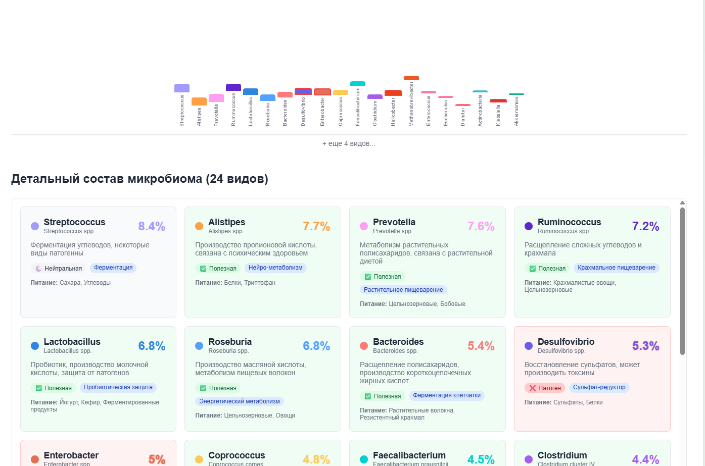
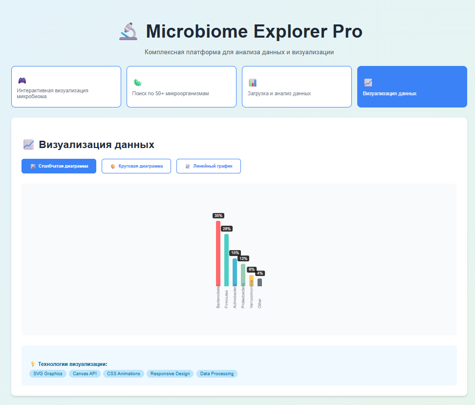

# 🔬 Microbiome Explorer Pro
**Профессиональная платформа для визуализации и анализа микробиома человека** - полнофункциональное React приложение, демонстрирующее современные веб-технологии.
## 📸 Скриншоты

| Симулятор микробиома | База знаний микроорганизмов |
|---------------------|-----------------------------|
|  |  |

| Анализатор CSV | Визуализация данных |
|----------------|---------------------|
|  |  |

## 🛠 Технологический стек

### Frontend
- **React 19** + TypeScript
- **Tailwind CSS** для стилизации
- **Framer Motion** для анимаций
- **Recharts** для графиков

### Функциональность
- **Three.js** для 3D визуализации
- **File API** для работы с файлами
- **SVG Graphics** для кастомных графиков
- **Drag & Drop** интерфейс

### Development
- **Vite** для сборки
- **ESLint** для качества кода
- **Git** для контроля версий

## 🎯 Возможности

### 🎮 Интерактивный симулятор микробиома
- Реалистичная симуляция 30+ видов бактерий
- Динамическая визуализация состава микробиома
- Расчет показателей здоровья и разнообразия
- Интерактивные элементы управления

### 🦠 База знаний микроорганизмов
- База данных 50+ видов бактерий с реальными характеристиками
- Продвинутый поиск и фильтрация по названию, семейству, месту обитания
- Категоризация (патогенные, пробиотические, кишечные, окружающая среда)
- Цветовая кодировка по семействам

### 📊 Анализатор CSV файлов
- Drag & Drop загрузка файлов
- Автоматический парсинг и анализ структуры данных
- Визуализация статистики и образцов данных
- Валидация и обработка ошибок

### 📈 Система визуализации данных
- Multiple типы графиков (столбчатые, круговые, линейные)
- SVG-based rendering для максимальной производительности
- Адаптивный дизайн для всех устройств
- Интерактивные элементы и tooltips

## 📦 Установка и запуск

```bash
# Клонирование репозитория
git clone https://github.com/zammartin2/microbiome-portfolio.git
cd microbiome-portfolio
```

# Установка зависимостей
```bash
npm install
```

# Запуск в development режиме
```bash
npm start

npm run buildproduction
```
